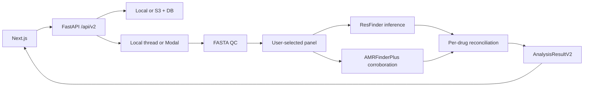

# Project handoff: Multi-Pathogen Genomic AST

## Executive summary

Hack Nation AI now produces **multi-drug genomic antibiograms** for user-selected organisms supported by ResFinder phenotype panels. ResFinder is the primary genotype-to-phenotype engine; AMRFinderPlus independently reports resistance determinants for corroboration. True scientific validation against phenotypic AST/MIC remains a separate milestone.

**Research use only. Not for clinical decisions.**

Repos:

- [frontend-nextjs](https://github.com/Asadyousaf03/frontend-nextjs)
- [backend-fastapi](https://github.com/Asadyousaf03/backend-fastapi)

## Architecture



## What works now

- Organism-required upload of assembled FASTA
- Fail-closed real-tool path (Docker/Modal) with pinned versions
- Fixture mode for CI/demos using golden ResFinder/AMRFinder outputs
- Versioned v2 result: antibiogram, evidence, tool runs, provenance
- Explicit call states: called / unknown / conflicting / tool_failed / unsupported
- Frontend antibiogram table + drug detail + provenance
- SSE progress for ResFinder / AMRFinderPlus / reconcile stages
- No silent Modal→local fallback; no motif/heuristic production predictions

## Pinned scientific runtime

| Component | Pin |
|---|---|
| ResFinder | 4.7.2 |
| ResFinder DB | 2.6.0 / commit `eecf0aa…` |
| PointFinder DB | 4.1.1 / commit `44ce624…` |
| AMRFinderPlus | 4.2.7 |
| AMRFinder DB | 2026-05-15.1 |

See `services/tools/versions.py`, `Dockerfile.tools`, `docker-compose.yml`.

## Local demo without binaries

```powershell
# backend
$env:TOOL_EXECUTION_MODE="fixture"
$env:ALLOW_FIXTURE_MODE="true"
$env:REQUIRE_REAL_TOOLS="true"
uvicorn main:app --reload --port 8001
python scripts/e2e_demo.py   # E. coli + S. aureus
pytest tests/test_api.py -q
```

## Real tools

```powershell
docker compose up --build
# GET /ready must report ready=true
```

Production: Render (API) + Modal (tools) + Postgres + S3.

## Semantics (say this to judges)

1. ResFinder = primary inference
2. AMRFinderPlus = corroboration, **not** validation
3. Unknown ≠ susceptible
4. Tool failure ≠ “no markers found”
5. Phenotypic AST validation is the next scientific milestone

## Priority roadmap

**P0** — Run pinned tools on independent genome+AST datasets; report sensitivity/specificity/VME by species-drug.

**P1** — Add taxonomic confirmation; enable validated short-read assembly.

**P2** — Expand panels, auth, retention, observability, prospective silent pilots.

## First tasks for new contributors

1. Read this handoff + both READMEs.
2. Run fixture e2e + pytest.
3. Build `Dockerfile.tools` and verify `/ready`.
4. Wire Modal secrets for Postgres/S3 and deploy `modal_app/app.py`.
5. Replace fixture demos with real-tool runs on public assemblies.
